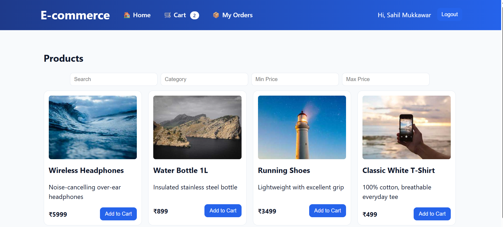
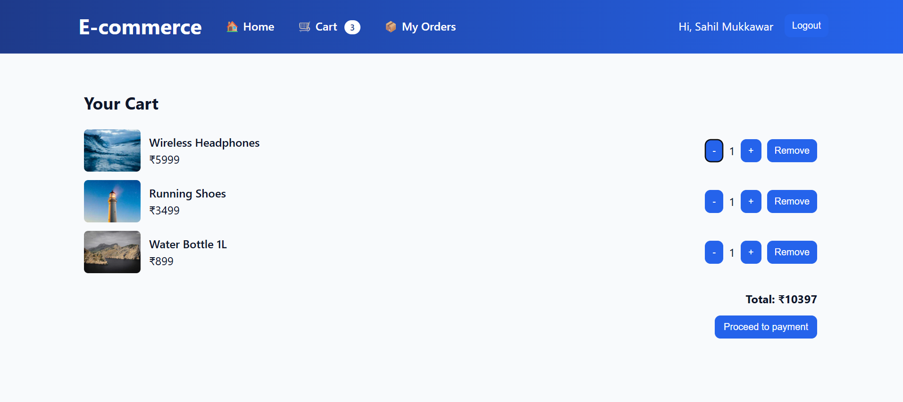
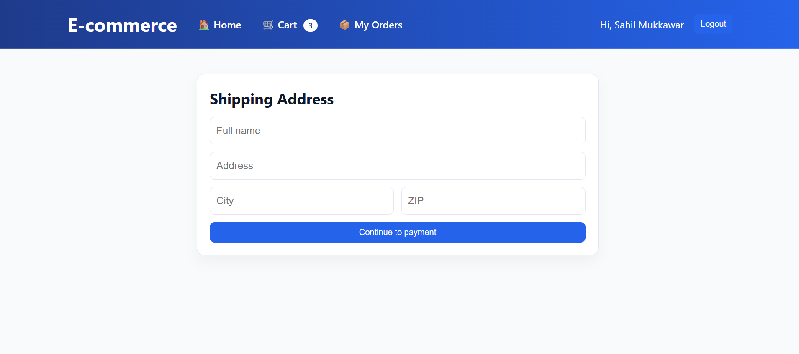
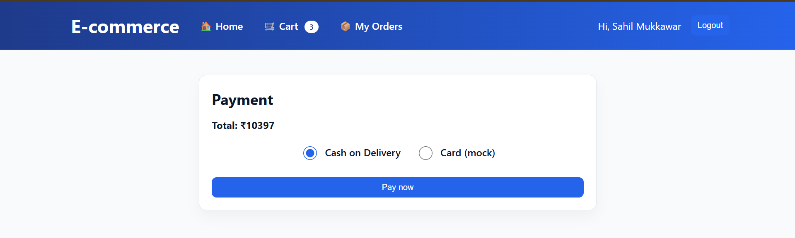
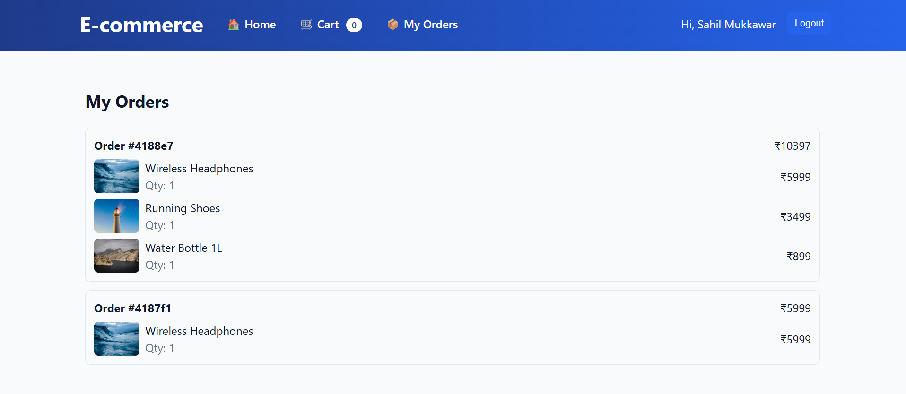

# E-commerce App (React + Node + MongoDB)
A full-stack e-commerce single page app with JWT authentication, product listing with filters, cart, checkout, and orders.

**Frontend:** React + Vite + TypeScript  
**Backend:** Node.js + Express + MongoDB (Mongoose)

## Features
- **Auth:** signup, login, JWT, protected routes
- **Products:** list, search, filter by category and price
- **Cart:** add/update/remove, quantity controls, badge counter
- **Checkout:** address form and mock payment (COD / card)
- **Orders:** create order from cart, view "My Orders"
- **UI:** modern navbar, centered pages, toast notifications

## Screenshots

### Home Page


### Shopping Cart


### Address Form


### Payment Options


### My Orders


## Project Structure
```
ecommerce-app/
├── backend/
│   ├── controllers/
│   ├── middleware/
│   ├── models/
│   ├── routes/
│   ├── config/
│   ├── server.js
│   ├── seed.js
│   └── package.json
└── frontend/
    ├── src/
    ├── public/
    │   └── images/
    ├── vite.config.ts
    └── package.json
```

## Setup Instructions

### Backend Setup
```bash
cd backend
npm install
```

Create `backend/.env` file:
```env
MONGODB_URI=your_atlas_uri
MONGODB_DB_NAME=ecommerce_app
JWT_SECRET=your_secret_key_here
PORT=5000
CLIENT_URL=http://localhost:5173
```

Seed demo items (optional):
```bash
npm run seed
```

Run development server:
```bash
npm run dev
```

API will be available at: `http://localhost:5000/api`

### Frontend Setup
```bash
cd ../frontend
npm install
```

Create `frontend/.env` file:
```env
VITE_API_URL=http://localhost:5000/api
```

Run development server:
```bash
npm run dev
```

Frontend will be available at: `http://localhost:5173`

## Available Scripts

### Backend
- `npm run dev` - Start development server with nodemon
- `npm run seed` - Populate database with sample data
- `npm run start` - Start production server

### Frontend
- `npm run dev` - Start development server
- `npm run build` - Build for production
- `npm run preview` - Preview production build

## API Endpoints

### Authentication
- `POST /api/auth/register` - User registration
- `POST /api/auth/login` - User login
- `GET /api/auth/me` - Get current user (protected)

### Products
- `GET /api/items` - Get all products
- `GET /api/items/:id` - Get single product
- `POST /api/items` - Create product (admin only)
- `PUT /api/items/:id` - Update product (admin only)
- `DELETE /api/items/:id` - Delete product (admin only)

### Cart (Protected Routes)
- `GET /api/cart` - Get user's cart
- `POST /api/cart` - Add item to cart
- `PUT /api/cart` - Update cart item quantity
- `DELETE /api/cart/:itemId` - Remove item from cart

### Orders (Protected Routes)
- `POST /api/orders` - Create new order
- `GET /api/orders` - Get user's order history

## Deployment

- **Frontend URL:** [To be updated after deployment]
- **Backend URL:** [To be updated after deployment]

Add your links above when ready. If using Vercel/Netlify for frontend and Render/Railway for backend, ensure CORS `CLIENT_URL` in backend .env matches the deployed frontend origin.

## Troubleshooting

### Common Issues

1. **MongoDB Atlas Connection Failed**
   - Make sure to add your IP address to Network Access in MongoDB Atlas
   - Verify your connection string includes the correct username and password

2. **Images Not Loading in README**
   - Ensure images are placed in `frontend/public/images/` directory
   - Check that image file names match exactly (case-sensitive)
   - Make sure image files are committed to your repository

3. **CORS Issues**
   - Verify `CLIENT_URL` in backend `.env` matches your frontend URL
   - Check that CORS is properly configured in your Express app

4. **Environment Variables Not Working**
   - Restart your development servers after changing `.env` files
   - Make sure `.env` files are in the correct directories
   - Verify environment variable names match your code

## Technology Stack

- **Frontend:** React 18, TypeScript, Vite, React Router, Axios
- **Backend:** Node.js, Express.js, MongoDB, Mongoose, JWT
- **Styling:** CSS3, CSS Variables for theming
- **Development:** ESLint, Prettier, Nodemon

## Customization

### Changing Theme
To modify the app's color scheme, edit the CSS custom properties in `frontend/src/App.css`:

```css
:root {
  --primary-color: #your-color;
  --secondary-color: #your-color;
  --background-color: #your-color;
}
```

---

## Contributing

1. Fork the repository
2. Create a feature branch (`git checkout -b feature/amazing-feature`)
3. Commit your changes (`git commit -m 'Add some amazing feature'`)
4. Push to the branch (`git push origin feature/amazing-feature`)
5. Open a Pull Request

## License

This project is licensed under the MIT License - see the [LICENSE](LICENSE) file for details.